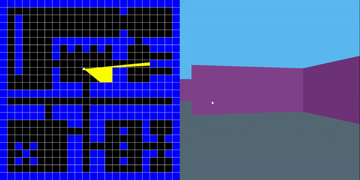

# beezyCaster
A basic raycaster

RayCasting technique from old Wolfenstein 3D games takes a 2D perspective (left half of demo) and projects it into a 3D-like space (right).
Uses DDA line-drawing algorithm for calculating straight line distances.
Reference: https://lodev.org/cgtutor/raycasting.html

SFML library used for windowing and rendering primitives (line, circle, rectangle).
W, A, S, D keys control the player, escape closes the window.
Basic collision detection with walls.
